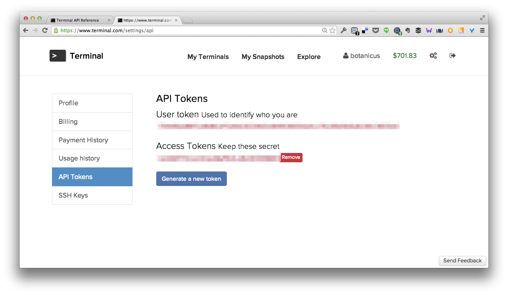
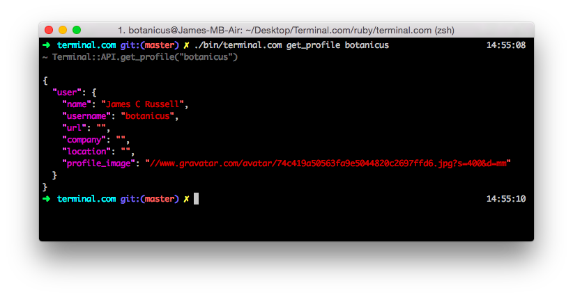
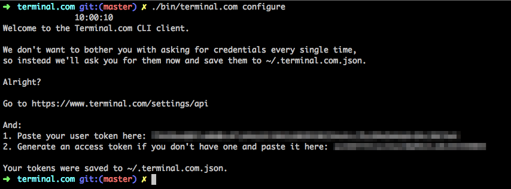

# About

[](https://travis-ci.org/botanicus/terminal.com)

[](http://rubydoc.org/gems/terminal.com/frames)


This is a Ruby wrapper for [Terminal.com](https://www.terminal.com) API. It works on **Ruby 2 compatible implementations** (_including Rubinius and JRuby_). Ruby 1.8 or 1.9 are not supported. It contains:

- [Low-level API](#low-level-api) which is 1:1 mapping to Terminal.com endpoints.
- [High-level object-oriented API](#high-level-terminalapi).
- [Command-line client](#command-line-client).

This library has **no external dependencies**. You can optionally use it with CodeRay to get syntax-highlighted responses in the command-line client, but the core doesn't depend on any 3rd party library.

The library uses `net/http` for network communication. Writing an adapter for a different HTTP library is as simple as overriding `Terminal.call` method. In the future more HTTP libraries _might_ be supported.

# Usage

1. Run `gem install terminal.com --development` or put `gem 'terminal.com'` into your Gemfile and run `bundle`. The development option installs coderay, so you get syntax highlighting for JSON on console when using the command-line client.

2. Get your `user_token` and `access_token` from [your settings](https://www.terminal.com/settings/api).



# API

**API docs:** [Latest release](http://www.rubydoc.info/gems/terminal.com/frames) | [Git HEAD](http://www.rubydoc.info/github/botanicus/terminal.com/master)

## Low-Level API

Module methods exposed on the `Terminal` module are 1:1 mapping of the Terminal.com API. The mapping rules are simple:

- All the required arguments are translated to positional arguments and comes in the same order as they are listed on the [Terminal.com API docs](https://www.terminal.com/api/docs) page.
- All the optional arguments are specified as keyword arguments (options).

### Example

```ruby
require 'terminal.com'

# Let's search featured ruby-related snapshots.
Terminal.list_public_snapshots(tag: 'ruby', featured: true)
# {"snapshots" => [{"title" => "JRuby Stack (example included)", "body" => "JRuby is a 100% Java implementation of the Ruby programming language. This snapshot also includes a working example, its source code and the tools needed to develop JRuby applications.", ...

# List your Terminals.
Terminal.list_terminals(my_user_token, my_access_token)
# {"terminals" => [{"cpu" => "2 (max)", "ram" => "256", "diskspace" => "10", "name" => "Coding Interview: John Doe Jr", ...

# Let's start a small instance of the official Ubuntu 14.04 snapshot.
snapshot_id = '987f8d702dc0a6e8158b48ccd3dec24f819a7ccb2756c396ef1fd7f5b34b7980'
Terminal.start_snapshot(my_user_token, my_access_token, snapshot_id, cpu: 100, ram: 1600)
# {"request_id":"1417456495137::james@101ideas.cz:create:207693::4e765da6-2cc0-4054-a0dc-00b47a004d79"}
```

## High-Level `Terminal::API`

Class `Terminal::API` provides *abstraction for calls to the endpoints that requires authentication*. So instead of calling methods on `Terminal` every time with passing `user_token` and `access_token` as arguments, you can just instantiate `Terminal::API` and reuse your credentials.

### Example

```ruby
require 'terminal.com/api'

terminal_com = Terminal::API.new(my_user_token, my_access_token)

# List your Terminals.
terminal_com.list_terminals

# Let's start a small instance of the official Ubuntu 14.04 snapshot.
snapshot_id = '987f8d702dc0a6e8158b48ccd3dec24f819a7ccb2756c396ef1fd7f5b34b7980'
terminal_com.start_snapshot(snapshot_id, instance: 'small')

# Note that for calls that don't require authentication,
# you still have to use methods on the Terminal module.
Terminal.list_public_snapshots
```

# Command-Line Client

Anything the library do can be done through the command-line client. There are two ways how you can use it: [with your credentials saved](#with-configuration) in `~/.terminal.com.json` or [without it](#without-configuration).

Arguments are mapped exactly the same way as in the Ruby API:

- All the required arguments are translated to positional arguments and comes in the same order as they are listed on the [Terminal.com API docs](https://www.terminal.com/api/docs) page.
- All the optional arguments are specified as keyword arguments.

## Keyword Arguments

- Booleans: `--featured` or `--no-featured`.
- Strings: `--tag=ruby`.
- Integers `--ram=256`.



## Without Configuration

This is a command-line equivalent of the low-level API: you have to specify `user_token` and `access_token` every single time.

```bash
terminal.com [user_token] [access_token] list_terminals
```

*Note that at the point you have to provide both `user_token` and `access_token` regardless of whether the API endpoint actually needs it. This will be fixed in near future!*

## With Configuration

This is a command-line equivalent of the high-level API: your `user_token` and `access_token` are saved in `~/.terminal.com.json`, so you don't have to pass them in every single time.

```bash
terminal.com list_terminals
```

### How to Save Your Credentials

Run `terminal.com configure` and follow the instructions.


